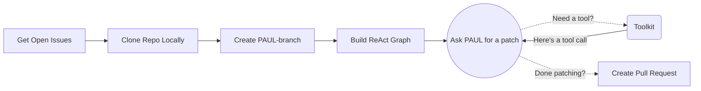

# PAUL – Patch Automation Using LLMs

**PAUL** (Patch Automation Using LLMs) is a developer tool that leverages Large Language Models to automatically address GitHub issues by reading, understanding, and patching codebases. With a single command, PAUL clones a GitHub repository, analyzes a given issue, and generates a targeted code fix, complete with a commit message and pull request.


## Setup

1. Clone the repository:
```bash
git clone https://github.com/MikeRaphK/PAUL.git
cd PAUL
```

2. Create a `.env` file and add your credentials:
```bash
GITHUB_TOKEN=your_github_token
OPENAI_API_KEY=your_openai_api_key
```

3. Install dependencies:
```bash
pip install -r requirements.txt
```

4. Build and run the Docker container locally:
```bash
docker build -t paul .
docker run -it -e GITHUB_TOKEN=${GITHUB_TOKEN} -e OPENAI_API_KEY=${OPENAI_API_KEY} paul
```

## GitHub Actions Integration

To use PAUL as a GitHub action in another repository, include the following workflow configuration as `.github/workflows/run-paul.yml`:
```yml
name: Run PAUL

on:
  workflow_dispatch:
    inputs:
      issue_number:
        description: "Issue Number"
        required: true
  issues:
    types: [opened, reopened]

jobs:
  run-paul:
    runs-on: ubuntu-latest
    steps:
      - name: Run PAUL
        uses: MikeRaphK/PAUL@main
        with:
          repo_url: https://github.com/${{ github.repository }}
          issue_number: ${{ github.event.issue.number || github.event.inputs.issue_number }}
          openai-api-key: ${{ secrets.OPENAI_API_KEY }}
          github-token: ${{ secrets.PAUL_GITHUB_TOKEN }}
```

## Usage
```bash
python main.py <GitHub Repository URL> <Issue Number>
```

Example:
```bash
python main.py https://github.com/yourusername/myproject 17
```

## Mermaid Chart


## License
MIT License


## Additional Information

For more details on how to contribute or troubleshoot, please refer to the [contributing guidelines](CONTRIBUTING.md) or check the [issues](https://github.com/MikeRaphK/PAUL/issues) page for commonly reported issues and their solutions.
