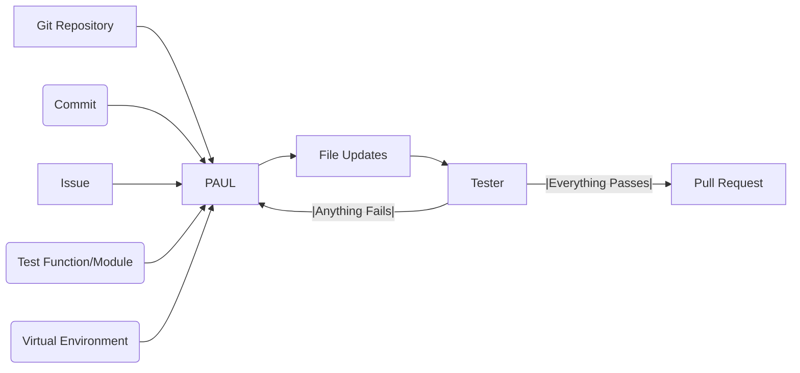

# PAUL: Patch Automation Using LLMs

**PAUL** (Patch Automation Using LLMs) is an open-source LLM-powered automation agent used for Automated Program Repair (APR). Supports a variety of modes including local repair, GitHub workflow automation, and evaluation on QuixBugs and SWE-bench Lite benchmarks.


## Dependencies
- **Python 3.12 or newer**
- [Docker](https://docs.docker.com/engine/install/) **or** [Poetry ≥2.0.0](https://python-poetry.org/docs/)  for setting up
- [OpenAI API Key](https://platform.openai.com/api-keys)
- [GitHub Personal Access Token](https://docs.github.com/en/authentication/keeping-your-account-and-data-secure/managing-your-personal-access-tokens): Only for GitHub mode, must allow opening and creating pull requests


## Installation
### Using Docker
Pull the Docker image from GitHub Container Registry with dependencies pre-installed:
```bash
docker pull ghcr.io/mikeraphk/paul:latest
docker run --rm -it -e OPENAI_API_KEY=... ghcr.io/mikeraphk/paul:latest bash
``` 

### Using Poetry
Clone the repository, create a virtual environment and install dependencies using Poetry:
```bash
git clone https://github.com/MikeRaphK/PAUL.git
cd PAUL
python3.12 -m venv venv
source venv/bin/activate
poetry install
export OPENAI_API_KEY=...
```

### GitHub Actions Integration
Add the workflow found in [`.github/workflows/run-paul.yml`](.github/workflows/run-paul.yml) to your public repository. In addition to your **OpenAI API key**, you will also need a **GitHub Personal Access Token** with permissions to open and create PRs. Store both keys securely using [GitHub Secrets](https://docs.github.com/en/actions/security-guides/encrypted-secrets) as `OPENAI_API_KEY` and `PAUL_GITHUB_TOKEN` respectively.


## Usage
Once installed, you can access the full CLI help at any time:
```bash
paul --help
```
This will show all available modes and options.

For more details and all available options for any subcommand, use:
```bash
paul <mode> --help
```

### Local mode
Point to a local repo and an issue description, and **PAUL** will attempt to produce a working patch locally. 

You can use the provided [PAUL-tests](https://github.com/MikeRaphK/PAUL-tests) repository, which contains example unit tests. These tests are continuously run using the [`.github/workflows/run-tests.yml`](.github/workflows/run-tests.yml) GitHub Actions workflow to ensure reliability and correctness across updates.

Example:
```bash
git clone https://github.com/MikeRaphK/PAUL-tests.git
paul local --path ./PAUL-tests/ --issue ./PAUL-tests/issues/is_anagram_issue.txt
```

### GitHub mode
After adding the [run-paul.yml]((.github/workflows/run-paul.yml)) to your public GitHub repository, open or edit an issue with the `PAUL` label. **PAUL** will attempt to produce a working patch and create a pull request with the patch implementation.


## Benchmarks
**PAUL**’s effectiveness and repair rate can also be evaluated on established benchmarks like QuixBugs and SWE-bench Lite.
### QuixBugs
**PAUL** passes all QuixBugs Python test cases, reliably fixing classic programming errors out of the box. Artifacts produced during QuixBugs runs are stored in the [artifacts](artifacts_quixbugs) folder.

Example:
```bash
paul quixbugs --path ./local/QuixBugs/ --file flatten.py --model gpt-4o
```

### SWE-bench Lite
**PAUL** is able to solve a subset of SWE-bench Lite tests, demonstrating its practical effectiveness on real-world Python bugs.

Example:
```bash
paul swebench --path ./local/sympy --split test --id sympy__sympy-20590 --test sympy/core/tests/test_basic.py::test_immutable --model gpt-4o
```
## PAUL workflow



## License
MIT License. See [LICENSE](LICENSE) for details.


## Credits
PAUL was created by Michael-Raphael Kostagiannis as part of a BSc thesis in the Department of Informatics and Telecommunications at the National and Kapodistrian University of Athens.

Special thanks to my supervisor, [Thanassis Avgerinos](https://cgi.di.uoa.gr/~thanassis/), and [kaizen](https://github.com/ethan42/kaizen).

