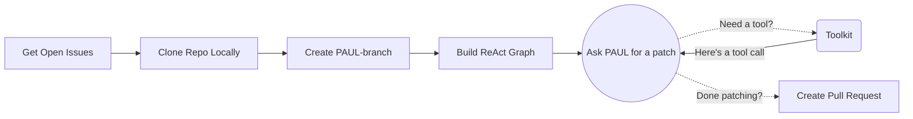

# PAUL – Patch Automation Using LLMs

**PAUL** (Patch Automation Using LLMs) is a developer tool that leverages Large Language Models to automatically address GitHub issues by reading, understanding, and patching codebases. Every time an issue is opened, PAUL analyzes it and generates a targeted code fix, complete with a commit message and pull request.

## GitHub Actions Integration

To use PAUL as a GitHub action in another repository, include the following workflow configuration as `.github/workflows/run-paul.yml`:
```yml
name: "Run PAUL"

on:
  # Workflow can be triggered with a click of a button. User inputs issue number.
  workflow_dispatch:
    inputs:
      issue_number:
        description: "Issue Number"
        required: true
  # Workflow is triggered automatically when an issue is opened/reopened
  issues:
    types: [opened, reopened, labeled, edited]

permissions:
  contents: write
  pull-requests: write

jobs:
  run-paul:
    runs-on: ubuntu-latest

    steps:
      - name: Checkout repository
        uses: actions/checkout@v4

      - name: Run PAUL Action
        uses: MikeRaphK/PAUL@main
        with:
          owner: ${{ github.repository_owner }}
          repo: ${{ github.event.repository.name }}
          issue: ${{ github.event.issue.number || inputs.issue_number }}
          openai-api-key: ${{ secrets.OPENAI_API_KEY }}
          github-token: ${{ secrets.PAUL_GITHUB_TOKEN }}
```

## Required Environment Variables

When using PAUL, you need to set the following environment variables in your system or GitHub Secrets:

- `OPENAI_API_KEY`: Your API key for accessing OpenAI's services. You can obtain this key from your OpenAI account.
- `PAUL_GITHUB_TOKEN`: This should be a fine-grained Personal Access Token (PAT) with read/write permissions for contents and pull requests. You can create it in your GitHub account settings.

To add these as GitHub Secrets, navigate to your repository on GitHub, go to Settings > Secrets and variables > Actions > New repository secret.

After setting up, open up a GitHub issue and PAUL will provide his help!

## Mermaid Chart
The chart outlines PAUL's workflow that works on GitHub repositories. It’s a linear process with a single main feedback loop for tool utilization.


## License
MIT License
